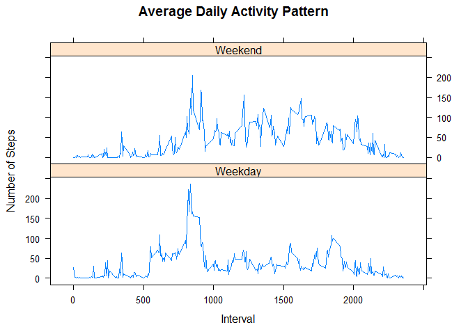

# Reproducible Research: Peer Assessment 1


This assignment analyzes data from a personal activity monitoring device.  
  
The variables included in this dataset are:  
- steps: Number of steps taking in a 5-minute interval (missing values are coded as NA)  
- date: The date on which the measurement was taken in YYYY-MM-DD format  
- interval: Identifier for the 5-minute interval in which measurement was taken  


##Loading and preprocessing the data  
Read the data from file:

```r
activityRaw <- read.csv("activity.csv", header = TRUE, na.strings = "NA")
```

Raw data dimensions and 10 sample records:

```r
dim(activityRaw)
```

```
## [1] 17568     3
```

```r
activityRaw[sample(nrow(activityRaw),10),]  
```

```
##       steps       date interval
## 15479     0 2012-11-23     1750
## 1617     30 2012-10-06     1440
## 2400    146 2012-10-09      755
## 10683     0 2012-11-07      210
## 993       0 2012-10-04     1040
## 1939      0 2012-10-07     1730
## 5690    135 2012-10-20     1805
## 10902     0 2012-11-07     2025
## 15238     0 2012-11-22     2145
## 11747    NA 2012-11-10     1850
```

NA values for field "steps"" will be exluded from analysis as they represent a lack of a measurement (not necessarily the same a an observation of "0"):

```r
activity <- subset(activityRaw, is.na(steps) == FALSE)   
activityNa <- subset(activityRaw,  is.na(steps) == TRUE)
numNaRecs <- nrow(activityNa)  
```

Cleansed data dimensions:

```r
dim(activity)
```

```
## [1] 15264     3
```

Aggregate clean data to get mean and sum of steps per day:

```r
library("plyr")
sumByDay<- ddply(activity,.(date),summarize, sumSteps = sum(steps))
```
##What is mean total number of steps taken per day?  

```r
hist(sumByDay$sumSteps, main = "Frequency of total steps taken per day", xlab ="Total steps taken per day", ylab = "Number of days")  
stepsMedian <- round(median(sumByDay$sumStep), 1)
stepsMean <- round(mean(sumByDay$sumStep),1)
abline(v=stepsMedian,lty = 2, lwd=2,col = "red")  
abline(v=stepsMean,lty = 3,lwd=1,col = "blue")  
legend("topright",c(paste0("median (", round(stepsMedian,1) ,")" ) ,paste0("mean (" , round (stepsMean,1) , ")")),lwd=2,col = c("red","blue"))
```

<!-- -->

Aggregate clean data to get average steps per interval:  

```r
avgByInt<- ddply(activity,.(interval),summarize, avgSteps = mean(steps))
```

##What is the average daily activity pattern?  

```r
plot(avgByInt$interval, avgByInt$avgSteps, type = "l", main = "Average Daily Activity Pattern", xlab ="5 minute time interval", ylab = "Average steps taken (across all days)", col = "blue")
```

<!-- -->

```r
maxInt <- avgByInt[avgByInt$avgSteps == max(avgByInt$avgSteps),c("interval")]
maxSteps <-round(max(avgByInt$avgSteps),2)
```
**Interval with average maximum steps**  
The maxinum number of steps (206.17) occurred in interval 835.  

##Imputing missing values     
As noted above, NA values were observed in the data.  2304 records were observed with missing values in the original activity monitoring data.  

**Implement impute strategy, create new data set with imputed steps**   

```r
library("mice")
imputedData <- mice(activityRaw,m=5, maxit = 5, method = "pmm", seed = 50)
```

```
## 
##  iter imp variable
##   1   1  steps
##   1   2  steps
##   1   3  steps
##   1   4  steps
##   1   5  steps
##   2   1  steps
##   2   2  steps
##   2   3  steps
##   2   4  steps
##   2   5  steps
##   3   1  steps
##   3   2  steps
##   3   3  steps
##   3   4  steps
##   3   5  steps
##   4   1  steps
##   4   2  steps
##   4   3  steps
##   4   4  steps
##   4   5  steps
##   5   1  steps
##   5   2  steps
##   5   3  steps
##   5   4  steps
##   5   5  steps
```

```r
##summary(imputedData)
activityImputed <-  complete(imputedData, 2)

sumByDayImputed<- ddply(activityImputed,.(date),summarize, sumSteps = sum(steps))
```

**Imputed data histogram**  

```r
hist(sumByDayImputed$sumSteps, main = "Frequency of total steps taken/day (with imputed missing values for steps)", xlab ="Total steps taken per day", ylab = "Number of days")  
stepsMedianImputed <- round(median(sumByDayImputed$sumStep),1)
stepsMeanImputed <- round(mean(sumByDayImputed$sumStep),1)
abline(v=stepsMedianImputed,lty = 2, lwd=2,col = "red")  
abline(v=stepsMeanImputed,lty = 3,lwd=1,col = "blue")  
legend("topright",c(paste0("median (", round(stepsMedianImputed,1) ,")" ) ,paste0("mean (" , round (stepsMeanImputed,1) , ")")),lwd=2,col = c("red","blue"))
```

<!-- -->


**Impact of imputing data**   
Comparing this chart with imputed steps to the chart above where missing steps were removed (in requirement 3), it is observed that the mean changed from 10766 to 11010 and the median change from 10765 to 11229.

##Are there differences in activity patterns between weekdays and weekends?  

```r
activityImputed$date = as.Date(activityImputed$date)
activityImputed$DayOfWeek <- ifelse(weekdays(activityImputed$date) == "Saturday" | weekdays(activityImputed$date) == "Sunday", "Weekend","Weekday")

avgByIntWD<- ddply(activityImputed,.(interval, DayOfWeek),summarize, avgSteps = mean(steps))

library("lattice")
xyplot(avgSteps ~interval | DayOfWeek, data = avgByIntWD, type = "l", layout=c(1,2), xlab = "Interval", ylab = "Number of Steps", main = "Average Daily Activity Pattern")
```

<!-- -->

